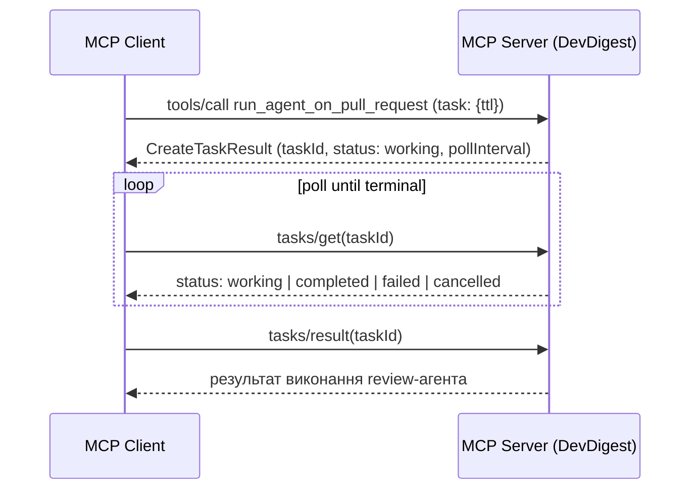

# Best practices для MCP-сервера DevDigest

> Статус: reference-документ. `devdigest-mcp` — це фіча лесона **L04**
> (`README.md:90`), реалізована в `mcp/`. Тут зібрано узагальнені
> best practices з офіційної MCP-специфікації та Anthropic engineering
> blog, щоб команда мала їх під рукою. Документ **не** описує конкретний
> план розробки для DevDigest — лише норми й паттерни, з посиланнями на
> джерела.

5 tools для контексту прикладів нижче: `list_agents`,
`run_agent_on_pull_request`, `get_findings`, `get_conventions`,
`get_blast_radius`.

## 1. Проєктування tools

- Кожен tool — стабільна унікальна назва (1–128 символів, `[A-Za-z0-9_.-]`),
  точний `description`, строгий `inputSchema` і, де можливо, `outputSchema`.
  Особливо важливо для tools, що повертають великі об'єкти (`get_findings`,
  `get_conventions`) — типізований вихід дає клієнту змогу генерувати
  типізовані обгортки, а не ганяти сирий JSON через контекст моделі.
- Помилки виконання (`PR не знайдено`, `агент не існує`) повертаються як
  `isError: true` у результаті `tools/call`, а не як JSON-RPC protocol
  error — так модель бачить actionable feedback і може самокоригуватись.
  Протокольна помилка (`-32602`, "unknown tool") — інший клас: сервер
  взагалі не знає про такий tool.

## 2. Обробка помилок і stub-інструментів

- Для tool, що технічно існує, але функціонал ще не реалізований
  (`get_blast_radius`), найкоректніший підхід — успішна відповідь
  (`isError: false`) зі структурованим маркером на кшталт
  `{"status": "not_implemented", ...}` у `content`/`structuredContent`,
  а не JSON-RPC error. Специфікація не дає готового прикладу саме такого
  "not implemented"-патерну — це екстраполяція із загальних правил
  `isError`/`structuredContent`, а не цитата.
- Не плутати два різні класи помилок: "tool не існує" (protocol-рівень,
  `-32602`) і "tool існує, але виконання не вдалося / ще не готове"
  (result-рівень, `isError: true` або статусне поле).

## 3. Пагінація

- Для tools, що повертають список (`list_agents`, `get_findings`) —
  офіційний механізм `cursor` / `nextCursor`, той самий патерн, що й у
  `tools/list`. Не повертати весь набір одним payload'ом за замовчуванням.

## 4. Довгі / асинхронні операції

`run_agent_on_pull_request` може тривати десятки секунд — кандидат на
**task-augmented execution**, офіційний, але явно позначений як
*experimental* механізм специфікації MCP (версія 2025-11-25):

- Клієнт додає `task: {ttl}` до запиту.
- Сервер одразу повертає `CreateTaskResult` (`taskId`, `status: "working"`,
  `pollInterval`).
- Клієнт після цього polling через `tasks/get`.
- Фінальний результат забирається через `tasks/result` — блокуючий виклик,
  доки статус не стане термінальним (`completed` / `failed` / `cancelled`).
- Tool сам декларує підтримку через `execution.taskSupport:
  "optional"|"required"|"forbidden"` у `tools/list`.
- Security: task-based виконання зобов'язане прив'язуватись до
  authorization-контексту — `tasks/get`/`tasks/result` для чужого `taskId`
  мають відхилятись; `taskId` повинен генеруватись криптографічно стійко.

Механізм позначено як experimental — специфікація прямо каже, що дизайн і
поведінка tasks можуть змінитись у майбутніх версіях протоколу; чи він уже
production-ready для конкретного релізу — окреме рішення, яке специфікація
не приймає за розробника.

## 5. Security

- Сервер **MUST**: валідувати весь вхід tools, застосовувати access
  control, rate-limit виклики, санітизувати вихід.
- Клієнт **SHOULD**: показувати вхідні параметри користувачу перед
  викликом і мати human-in-the-loop confirmation для чутливих операцій —
  це прямо стосується `run_agent_on_pull_request`, що фактично витрачає
  ресурси (час/гроші) на прогін review.
- Task-based виконання: bind до authorization context, криптографічно
  стійкі `taskId`, заборона доступу до чужих задач.

## 6. Мінімізація token footprint при старті чату

Головний висновок офіційної документації: **для набору з ~5 tools ця
проблема практично не стоїть**. Поріг, з якого варто щось оптимізувати —
коли схеми tools займають помітну частку контексту (рекомендація: 1–5%
context window). "For a handful of tools, loading all upfront is perfectly
reasonable."

### 6.1 Progressive discovery

- Це паттерн рівня **MCP host/client**, не самого протоколу. Сервер завжди
  віддає повний `tools/list`; хост вирішує, чи інжектити всі визначення в
  контекст моделі одразу, чи спершу дати легкий `search_tools`-meta-tool
  і довантажувати визначення по мірі потреби.
- Найбільший економічний важіль — не текст `description` окремого tool, а
  кількість tools і серверів, підключених одночасно: experiments Anthropic
  показують падіння з ~77k до ~8.7k токенів (≈85%) при обрізанні набору
  tools у multi-server конфігураціях.

### 6.2 Meta-tool trade-off

- Один tool з `action`-параметром замість 5 окремих виправданий переважно
  коли (a) каталог tools великий/динамічний, або (b) кілька MCP-серверів
  дублюють функціонал і потрібен routing. Для 5 чітко різних, статичних
  операцій DevDigest tradeoff (втрата типізації input/output на кожен
  action, гірша discoverability, ширша поверхня для prompt injection через
  meta-tool) переважає виграш.
- "Outside of specific conditions, meta-tools introduce unnecessary
  complexity... requiring teams to recognize and manage this trade-off."

### 6.3 Prompt caching

- Хости кешують `tools/list` у межах розмови (conversation-boundary
  operation), а не обов'язково персистентно між сесіями — це деталь
  реалізації конкретного хоста, специфікацією не деталізована.
- При змінах схем — не перевпорядковувати вже закешований масив `tools`:
  нові визначення додавати в кінець, після cache breakpoint. Ресортування
  ламає prompt caching у провайдера й коштує дорожче, ніж сама економія
  контексту.

### 6.4 Dynamic server management

- Групування рідковживаних інструментів в окремий MCP-сервер, який хост
  підключає лише за потреби (`enable_server`/`disable_server`) —
  задокументований офіційний патерн. Рішення реалізується на боці хоста;
  сервер лише надає чіткий high-level опис себе в реєстрі.

### 6.5 Практичні техніки (застосовні незалежно від розміру каталогу)

- Короткий, точний `description`, без прикладів і довгих enum-списків у
  самій схемі (приклади — в окремий, опційно завантажуваний виклик, якщо
  колись знадобиться).
- `outputSchema` для кожного tool — типізований вихід замість сирого
  великого payload'а в контексті моделі.
- Пагінація для списків (`list_agents`, `get_findings`) — див. розділ 3.
- Programmatic tool calling / code execution pattern: модель пише код, що
  фільтрує великий результат у sandbox, у контекст моделі повертається
  лише підсумок (приклад з Anthropic blog: 150 000 → 2 000 токенів, ≈98.7%
  економії).

## 7. Дизайн-принципи tool interface (командні best practices)

Чотири принципи, зафіксовані командою окремо від дослідження вище — застосовні
до кожного з 5 tools, доповнюють розділи 1–6, а не суперечать їм:

- **Результат, а не операція.** Tool повертає готовий результат бізнес-дії,
  а не низькорівневий крок. `run_agent_on_pull_request(repo, pr, agent)` сам
  виконує послідовність "створити прогін → дочекатись → забрати findings" —
  модель викликає один tool, а не оркеструє три.
- **Плоскі аргументи.** `repo`, `pr`, `agent` — окремі прості значення
  (string/number), не вкладений об'єкт. Моделі (особливо не від Anthropic)
  частіше помиляються при заповненні вкладених структур, ніж плоского набору
  полів — узгоджується з розділом 1 (строгий, простий `inputSchema`).
- **Стисла структурована відповідь.** Повертати лише потрібні поля
  (`{verdict, findings[]}`), не сирий dump усієї моделі даних — одна "повна"
  відповідь легко з'їдає десятки тисяч токенів контексту. Пряме продовження
  розділу 6.5 (`outputSchema`, programmatic tool calling): відповідь має бути
  спроєктована стислою від самого початку, а не стискатись пост-фактум.
- **Помилка веде далі.** Замість сухого коду/статусу текст помилки називає
  наступний крок (`"агента не знайдено, виклич list_agents"`), щоб модель не
  застрягала, а сама скоригувала виклик. Конкретизує вимогу розділу 1 щодо
  `isError: true` + "actionable feedback": actionable означає "вказує, який
  tool викликати далі", а не просто описує, що пішло не так.

## References

| Джерело | Що покриває | Тип |
|---|---|---|
| [MCP Specification — Tools (2025-11-25)](https://modelcontextprotocol.io/specification/2025-11-25/server/tools) | naming, схеми, error handling, security для tools | первинне |
| [MCP Specification — Tasks (2025-11-25)](https://modelcontextprotocol.io/specification/2025-11-25/basic/utilities/tasks) | task-augmented execution (experimental), security tasks | первинне |
| [MCP Client Best Practices (2026-07-28)](https://modelcontextprotocol.io/docs/2026-07-28/develop/clients/client-best-practices) | progressive discovery, threshold-рекомендації, prompt caching, dynamic server management | первинне |
| [Anthropic Engineering — Code execution with MCP](https://www.anthropic.com/engineering/code-execution-with-mcp) | code-execution pattern, конкретні цифри економії токенів | первинне (Anthropic blog) |
| [modelcontextprotocol/modelcontextprotocol#982](https://github.com/modelcontextprotocol/modelcontextprotocol/issues/982) | еволюція async-паттернів до фінального SEP по tasks | первинне (issue tracker) |
| [StackOne — MCP token optimization](https://www.stackone.com/blog/mcp-token-optimization/) | приклад економії токенів через обрізання tool-set (≈85%) | вторинне |
| [Credal — Meta-tools in MCP](https://credal.ai/meta-tools-in-mcp-why-are-they-important) | практичні tradeoffs meta-tool паттерну | вторинне |

## Open questions

- Чи MCP hosts (включно з Claude Code) кешують tool schemas персистентно
  між сесіями, а не лише в межах розмови — специфікація описує
  `ttlMs`/`cacheScope` hints і "conversation-boundary operation", але не
  деталізує file-system persistence на рівні хоста.
- Точний рекомендований формат "status"-поля для stub-tools —
  специфікація не дає готового прикладу "not implemented" відповіді;
  висновок у розділі 2 — екстраполяція, не цитата готового патерну.
- Чи task-augmented execution (2025-11-25) вже достатньо стабілізувався
  для production use в DevDigest L04 — специфікація прямо позначає
  механізм як experimental і залишає можливість зміни поведінки в
  майбутніх версіях протоколу.
