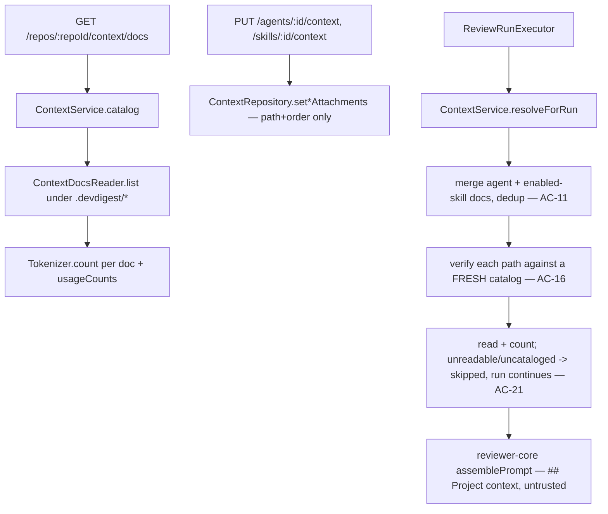

# modules/context — Project Context Folder

Manual (no auto-selection) attachment of a repository's own `.md` documents —
under its `.devdigest/{specs,docs,insights}/` folder, never the repo's
top-level `specs/`/`docs/`/`insights/` — to agents and skills, and mechanical
insertion of their text into the review prompt as untrusted data. Normative
spec: `specs/2026-08-26-project-context-folder.md`.

## Pipeline

## Authoring (spec 2026-08-27-project-context-folder-authoring)

Write path added on top of the read-only base spec. **Postgres
(`project_context_nodes`) is the source of truth** (AC-24); the file under
`server/clones/<repo>/.devdigest/**` is a derived projection, rewritten from
the DB by `ContextService.materialize()` before every catalog scan / run
resolution when its sha drifts (AC-25). Nothing is ever `git add`ed (AC-26).

| Route | Purpose |
|---|---|
| `POST /repos/:repoId/context/docs` | create an empty `.md` document (AC-29) |
| `POST /repos/:repoId/context/docs/upload` | upload a `.md` file — base64 JSON body, ~1.5 MiB route `bodyLimit`, 1 MiB decoded ceiling (AC-31/32) |
| `PUT /repos/:repoId/context/docs/content` | save an edit — last-write-wins, no precondition (AC-34/35) |
| `POST /repos/:repoId/context/folders` | register an empty folder branch (AC-30) |
| `GET /repos/:repoId/context/folders` | explicitly-registered folders (the tree merges these with the doc catalog) |
| `GET /repos/:repoId/context/docs/coverage?path=` | COVERAGE: workspace agents with the doc attached ÷ all workspace agents; `percent: null` when the workspace has no agents (AC-39/40) |

- **Path validation is `validateContextPath` in `helpers.ts` (pure, no I/O)** —
  the write-side mirror of AC-16, run before any FS/DB write (AC-37). The
  symlink half is I/O and lives in `FsContextDocsReader.resolveInside`, which
  now backs both `read()` and `write()`.
- **`FsContextDocsReader` implements `ContextDocsReader` AND
  `ContextDocsWriter`** — one class, one root-containment check for both
  directions.
- Write auth is identical to reads: `getContext(app.container, req)` only, no
  extra role check (AC-36).

## Why the shape is this way

- **`ContextService` takes ports (`ContextRepository`, `ContextDocsReader`,
  `Tokenizer`), never `Container`.** `container.ts` constructs this service,
  so accepting `Container` would close a container → service → container
  cycle — the same shape `RepoIntelDeps`/`IntentDeps` already document.
- **A document's identity is its full repo-relative path, never its file
  name or an id** — two `security-baseline.md` files in different folders
  are different documents. Attachments (`agent_context_docs` /
  `skill_context_docs`) store only `(path, order)`, never a content copy
  (AC-8), so nothing here becomes stale when the file's content changes.
- **AC-16 is enforced by re-listing the catalog on every read path** — the
  catalog check in `readContent` (preview) and `resolveForRun` (a run) is
  built fresh from the filesystem each time, never from a client-supplied or
  previously-cached list. A path outside that catalog is rejected before any
  `fs` call.
- **`resolveForRun` never throws.** A path that isn't in the run-time catalog
  or fails to read lands in `skipped`, not an exception — the caller
  (`ReviewRunExecutor`) decides how to log it (AC-21: the run continues, the
  skip is visible in the trace).
- **reviewer-core is untouched.** `assemblePrompt`'s `specs` slot, delimiter
  wrapping, and empty-array omission already satisfy AC-12/13/14/15; this
  module only produces the resolved strings reviewer-core's `ReviewInput.specs`
  expects.

## Do not touch

- No denylist/regex/keyword scan over document text — the shared
  `INJECTION_GUARD` in `reviewer-core/src/prompt.ts` is the only defense
  (spec's "Untrusted inputs" section is explicit about this).
- No server-side limit on attachment count/size/token volume (AC-22) — the
  UI's visible token estimate is the only safeguard for this iteration.
