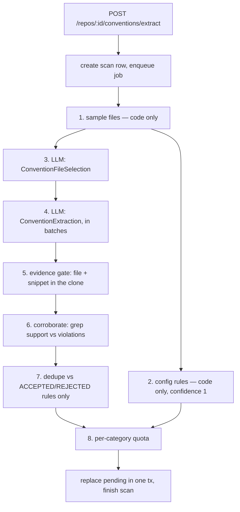

# modules/conventions — Conventions Extractor

Turns a repository into a reviewed list of house conventions, and the accepted
ones into a single skill. Requirements live in
[specs/conventions-extractor.md](../../../../specs/conventions-extractor.md).

## Pipeline

Every step publishes to `container.runBus` keyed by the **scan id**, so the SSE
route streams the same event shape a review run does — including each drop and
its reason.

## Why the shape is this way

- **The model never has the last word.** It proposes rules and the regexes to
  check them with; steps 5–7 decide what survives. `confidence` on a stored
  candidate is a counted ratio, not the model's self-report (which is kept as
  `model_confidence` for diagnostics only).
- **Repair beats drop.** Models quote real code but routinely miss the line
  number. `findSnippetLine` re-anchors the snippet; only a snippet that is
  nowhere in the file is discarded.
- **Config rules cost nothing.** `rulesFromConfigs` derives conventions from
  eslint/tsconfig/prettier deterministically, which is also what keeps an
  unindexed repo from returning an empty screen.
- **Model output is untrusted input.** Repo file content steers the model, so
  everything the model returns is treated as attacker-influenced: `evidence_path`
  is checked for traversal before it reaches `git.readFile`, and the grep
  patterns are refused if they are uncompilable, ReDoS-shaped, over-long, or
  start with `-` (ripgrep parses flags in any argv position, and `--pre=<cmd>`
  executes a command per file — the adapter now also passes `--`). File bodies
  go into the prompt through `wrapUntrusted` with the guard the review engine
  uses, rather than being scanned for suspicious phrasings downstream.
- **A check that could not run is not a check that passed.** If either grep
  fails, the candidate is dropped instead of being credited zero violations —
  otherwise a broken counter-pattern would award a perfect 1.0 exactly because
  the verification failed.
- **Batches, not one big call.** One call over twelve files yields a handful of
  generic rules; several calls over four files each yield more specific ones,
  and a failed batch does not take the scan down.

## Files

| File | Role |
|---|---|
| `routes.ts` | HTTP + SSE + job-handler registration (entry ring) |
| `service.ts` | the pipeline above (application ring) |
| `repository.ts` | the only code touching `conventions` / `convention_scans` |
| `helpers.ts` | pure logic: snippet matching, confidence math, skill markdown |
| `constants.ts` | thresholds — sample size, batch size, `MIN_SUPPORT`, quotas |

## Tests

- `server/test/conventions-helpers.test.ts` — the gate's logic, no Docker.
- `server/test/conventions.it.test.ts` — the pipeline end to end against a mock
  model that proposes a deliberate mix of real, invented and unsupported rules.
