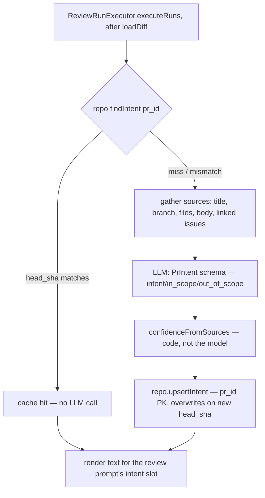

# modules/intent — PR Intent

Derives a PR's **intent** — one sentence of motivation, `in_scope[]`,
`out_of_scope[]` and a code-computed `confidence` — before
the main review, from sources already in the system. Feeds the review prompt
as CONTEXT ONLY. Normative spec: `specs/pr-intent-layer.md`.

## Pipeline

## Why the shape is this way

- **The model never sets its own confidence.** `confidenceFromSources` derives
  it purely from which sources were available (`sources[]`), which is itself
  built from labels the code assigns — never from model output. This is both
  the calibration fix and the injection defense: text hidden in a PR body or a
  linked issue cannot raise its own trust.
- **Cache key is `(pr_id, head_sha)`, but the table's PK is `pr_id` alone.** A
  new head SHA overwrites the row — intent history is not kept, deliberately
  (see `plans/intent-layer.md` §3).
- **Never a blocking dependency.** `ReviewRunExecutor` wraps the whole step in
  try/catch; any failure logs a warning and the review proceeds with the
  `intent` prompt slot simply omitted — exactly like `callers`/`repoMap`.
- **Cross-repo linked issues (`owner/repo#123`) are recognized but never
  fetched** — the token may not have access to the other repo, and it's out of
  scope regardless (decision #6). They still show up in `sources[]` as
  `owner/repo#123 (skipped)` so the label isn't a lie.
- **`IntentService` takes `IntentDeps` (explicit ports), never `Container`.**
  `container.ts` constructs this service, so accepting `Container` here would
  close a container → service → container cycle — the same shape
  `RepoIntelDeps` documents (`repo-intel/types.ts`).

## Cost attribution

The intent LLM call happens **once per set of queued runs**, not once per
run. `ReviewRunExecutor` attributes its `tokensIn`/`tokensOut`/`costUsd` to
`completeAgentRun` of the **first queued run only**, and only on a cache
miss — every other run (and every cache hit) gets zero. See
`plans/intent-layer.md` §8 for the full rule and its rationale.

## Do not touch

- Step 9 (in-repo spec/plan file reading) is disabled by decision #5 of
  `plans/intent-layer.md` and not implemented at all — no flag, no reader.
  Do not add one without a fresh decision from the user.
