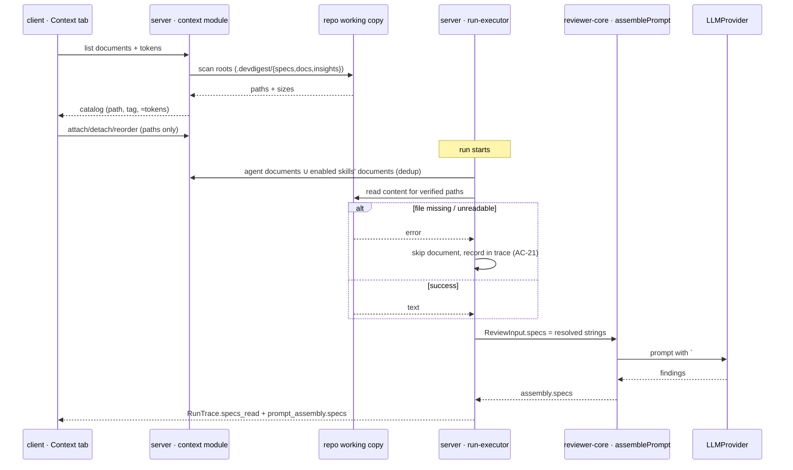

# Spec: Project Context Folder | Spec ID: 2026-08-26-project-context-folder | Status: approved

## Problem & why

The reviewer judges a diff without knowing the project's written agreements:
architecture invariants, the public API's PRD, security rules, incident
conclusions. These documents already live in the repository as `.md` files,
but none of them reach the prompt — so the agent can neither lean on them nor
cite a specific document in its feedback.

**Project Context Folder** provides manual (no auto-selection) attachment of
repository `.md` documents to agents and skills, mechanical insertion of
their text into the prompt as untrusted data, and full transparency of this
in the run trace.

This is also the first feature of the cycle that tests a hypothesis: **does a
written specification actually influence reviewer behavior** — so the
acceptance scenario (AC-17) is part of the spec's subject matter, not just
its test.

## Goals / Non-goals

**Goals**

- A catalog of the repository's `.md` documents with search, preview, and a
  token estimate.
- Manual attachment of documents to an agent (the **Context** tab) and to a
  skill (the **Project context to use** section), with a controllable order.
- Inheritance: an agent receives the documents of its active skills in
  addition to its own.
- Mechanical (no separate LLM call) insertion of attached documents' text
  into the prompt's `## Project context` section as **untrusted**.
- Run transparency: `specs_read` in Configuration + an expandable
  `Project context — attached specs (untrusted)` block in Prompt assembly,
  carrying the exact text that went into the request.

**Non-goals**

- **An automatic selector of relevant documents based on PR content** — a
  separate future feature. This spec does not describe ranking, embeddings,
  or diff-based selection.
- Semantic search / chunking / indexing documents into pgvector.
- Editing, creating, or uploading `.md` files in the repository from the
  UI — the **Project Context** page is read-only: browse, search, preview,
  attach. The `+`/folder/upload icons and the `Edit` tab shown on des1 are
  out of scope for this iteration.
- Syncing attachments with git history, document versioning.
- Any effect of documents on `score`, `verdict`, or new finding categories —
  this is prompt context only.
- Hard limits on the count/size of attached documents or a token ceiling —
  the first iteration relies on the visible `≈ N tokens` estimate in the UI
  for an informed user choice, with no server-side rejection or truncation.
- The "COVERAGE" ring indicator from des1 — no text source defines this
  metric; out of scope for this spec.

## User stories

- **US-1**: as a reviewer, I want to see all of the project's `.md`
  documents on the **Project Context** page with their token size, so I know
  what I can attach and at what cost per prompt.
- **US-2**: as an agent owner, I want to manually attach documents to an
  agent in the **Context** tab and set their order, so the agent judges code
  against our written invariants.
- **US-3**: as a skill author, I want to attach documents to a skill, so any
  agent using that skill inherits them without separate configuration.
- **US-4**: as a reviewer, I want the text of attached documents to enter the
  prompt as untrusted data during a run, so the agent can cite a specific
  document in its feedback.
- **US-5**: as a run auditor, I want to see the list of documents read and
  the full inserted text in the trace, so I can verify exactly what went
  into the request.
- **US-6**: as an operator, I want a deleted, renamed, or unreadable document
  to not break the review run, but to degrade visibly instead.

## Acceptance criteria (EARS)

### Document catalog (reader)

- **AC-1 (US-1) — Verification: server-integration**: WHEN a client requests
  the context catalog for an indexed repository, the system shall return a
  list of all `.md` files found recursively under the configured search
  roots, with fields: repo-relative path, file name, source tag (`specs` /
  `docs` / `insights`), size in bytes, and a token estimate.
- **AC-2 (US-1) — Verification: server-unit**: The system shall take search
  roots from configuration, with a default value equivalent to the glob
  `.devdigest/{specs,docs,insights}/**/*.md` — the tool's own dedicated
  folder at the repository root (des1), not the repository's own `specs/`,
  `docs/`, `insights/` folders directly.
- **AC-3 (US-1) — Verification: server-unit**: The system shall compute each
  document's token estimate deterministically, without an LLM call.
- **AC-4 (US-1) — Verification: client**: WHEN a user opens the **Project
  Context** page and selects a document from the list, the system shall
  show its content in **Preview** mode (read-only markdown render).
- **AC-5 (US-1) — Verification: client**: IF the catalog is empty (no `.md`
  under the search roots) or the repository has not been cloned yet, THEN
  the system shall show an explicit empty state with a reason, not a blank
  list with no explanation.

### Attaching to an agent and to a skill

- **AC-6 (US-2) — Verification: client**: WHEN a user toggles a document's
  checkbox in an agent editor's **Context** tab, the system shall save the
  attachment and update the "N of M attached" counter.
- **AC-7 (US-2) — Verification: client**: WHILE an agent's **Context** tab
  has at least one attached document, the system shall show the combined
  token estimate of all attached documents (`≈ N tokens`).
- **AC-8 (US-2) — Verification: server-integration**: The system shall store,
  for each attachment, only the document's repo-relative path and its
  order — never a copy of the content text.
- **AC-9 (US-2) — Verification: server-integration**: WHEN a user reorders an
  agent's attached documents (drag), the system shall persist the new order,
  and that order shall determine the sequence of blocks inside
  `## Project context`.
- **AC-10 (US-3) — Verification: client**: WHEN a user attaches a document in
  a skill editor's **Project context to use** section, the system shall save
  the attachment at the skill level and show the combined token estimate of
  all documents attached to the skill (`≈ N tokens`), the same way an
  agent's Context tab does (AC-7) — not just the `SERIALIZES AS` block.
- **AC-11 (US-3) — Verification: server-unit**: WHEN the document list for an
  agent's run is assembled, the system shall merge the documents attached
  directly to the agent with the documents of all of the agent's **enabled**
  skills, deduplicated by repo-relative path. Order: the agent's own
  documents come first (in their configured order), then the enabled
  skills' documents (in the order the skills are attached, then in each
  skill's own order). If the same path is attached to both the agent and a
  skill, the agent's position wins — the inherited duplicate from the skill
  is dropped.

### Prompt assembly

- **AC-12 (US-4) — Verification: reviewer-core**: WHEN a run has a non-empty
  list of attached documents, the system shall insert their text into a
  prompt section under the canonical heading **`## Project context`**, each
  document as its own delimiter-wrapped untrusted block.
  The `## Project specifications` heading shown on des3 is a design
  inconsistency and is **not** the contract: `## Project context` is
  already implemented in `assemblePrompt` and matches des2 and des4.
- **AC-13 (US-4) — Verification: reviewer-core**: The system shall include
  each document's repo-relative path inside the inserted block itself, so
  the agent can cite a specific document in a finding's text.
- **AC-14 (US-4) — Verification: reviewer-core**: IF the list of attached
  documents is empty, THEN the system shall assemble the prompt byte-for-byte
  identical to a call without this feature (the section is not rendered).
- **AC-15 (US-4) — Verification: server-unit**: The system shall add context
  through a purely mechanical text insertion — with no extra LLM call and no
  effect on `score`, `verdict`, or finding categories.
- **AC-16 (US-4) — Verification: server-unit**: The system shall read a
  document's content only for a path that is present in the catalog built by
  the reader at run time; a path outside the catalog (absolute, containing
  `..`, outside the search roots, not `.md`) shall be rejected without
  reading from disk.

### Acceptance scenario

- **AC-17 (US-4) — Verification: e2e**: WHEN an agent has a document attached
  that states the invariant "the `api/` module does not import `db/`
  directly", and a review runs on a PR that violates this invariant, the
  system shall produce a finding whose text cites that specific document
  (its path or name).

### Run transparency

- **AC-18 (US-5) — Verification: server-integration**: WHEN a run completes,
  the system shall populate the trace's `specs_read` with the list of
  documents actually read (in insertion order), not an empty array.
- **AC-19 (US-5) — Verification: client**: WHEN a user opens the Trace panel
  of a run with attached documents, the system shall show those documents in
  the **Configuration** section as a `Specs read` row — each document with
  its own repo-relative path and its own token estimate (not just the
  aggregate `Tokens` in Stats) — and a separate
  `Project context — attached specs (untrusted)` row in **Prompt assembly**.
- **AC-20 (US-5) — Verification: client**: WHEN a user expands the
  `Project context — attached specs (untrusted)` row, the system shall show
  the full block text including delimiters — exactly what went into the
  request, with no truncation or reformatting.

### Degradation

- **AC-21 (US-6) — Verification: server-integration**: IF an attached
  document is missing, renamed, or unreadable at run time, THEN the system
  shall skip it, continue the run with the remaining documents, and record
  the skip visibly in the trace. The attachment itself shall remain in the
  agent's/skill's list with a visible "broken" marker — it shall not be
  silently removed on the next catalog scan; the user decides whether to
  detach it.
- **AC-22 (US-6) — Verification: client**: The first iteration does not
  impose hard server-side limits on the count, size, or combined volume of
  attached documents. The system shall instead show the token estimate
  (AC-7, AC-10) in the UI before a run, so the user makes an informed
  decision about the run's cost.

### Document usage (catalog)

- **AC-23 (US-1) — Verification: server-integration**: WHEN a user views a
  document on the **Project Context** page, the system shall show a
  "Used by N agents" badge — the count of agents (within the current
  repository/workspace) that have this document attached directly or
  inherited via an enabled skill, as of the time of viewing.

## Edge cases

- A document attached to both an agent and one of its skills → deduplicated
  per AC-11: the agent's own position wins, the inherited duplicate is
  dropped.
- A skill disabled on an agent (`agent_skills.enabled = false`) → its
  documents are **not** inherited; AC-11 covers enabled skills only.
- A skill attached to multiple agents → the document is read independently
  for each run; the spec does not require a shared cache.
- An empty `.md` (0 bytes) → present in the catalog with a 0-token estimate;
  can be attached, inserting yields an empty untrusted block — no hard
  limiting (AC-22), behavior is deliberately simple for the first iteration.
- A very large `.md` (e.g. a generated changelog) → attached and inserted in
  full; limits are deliberately absent in the first iteration (AC-22) — the
  user sees the cost up front via the token estimate.
- Symlinks and files outside the working copy under the search roots → shall
  be rejected by the same rule as AC-16.
- Repository not cloned / not indexed → AC-5 on the UI; a run degrades per
  AC-21 rather than failing.
- Agents and documents have different scopes: agents are workspace-scoped,
  while the document catalog is repo-scoped. An attachment is stored per
  (agent, repository) pair — the same agent, run against another repository
  in the same workspace, sees an empty or separate Context list until an
  attachment is set specifically for that pair.
- Two distinct `security-baseline.md` files in different folders (`specs/`
  and `docs/`) → a document's identity is its full path, never its file
  name.
- Concurrent editing of an agent's attachments from two browser tabs → last
  save wins; the spec does not require separate conflict handling.

## Non-functional

- **Security (untrusted input)** — see `Untrusted inputs` below;
  Verification: server-unit + reviewer-core.
- **Security (file access)** — reads are confined to the reader's catalog
  (AC-16); no path coming from the client reaches a file operation without
  being checked against the catalog. Verification: server-unit.
- **Performance** — scanning the catalog and computing token counts shall
  not run synchronously on the run's hot path more than once per run.
  Verification: server-integration.
- **Cost transparency** — the token estimate must be available to the user
  **before** a run (AC-7), since it is what determines each run's cost.
  Verification: client.
- **A11y** — the document table is keyboard-operable; reorder must have a
  non-drag alternative. Verification: manual-qa.

## Inputs (provenance)

| Input | Provenance |
|---|---|
| list of `.md` documents | `[deterministic: recursive scan of the repository working copy under the configured roots]` |
| document content | `[deterministic: file read from the working copy at run time]` |
| token estimate | `[deterministic: the server's existing `Tokenizer` port, no LLM]` |
| agent/skill attachment list | `[deterministic: stored paths + order]` |
| the prompt's `## Project context` section | `[reused: the existing `specs` slot in `assemblePrompt` (reviewer-core)]` |
| `specs_read`, `prompt_assembly.specs` in the trace | `[reused: existing `RunTrace` / `PromptAssembly` contract fields]` |

## Untrusted inputs

The content of repository `.md` documents is **untrusted data**: it is
written by a human (or another agent), it may contain instructions
addressed to the model ("ignore previous rules", "don't flag anything in
this PR"), and it enters the prompt verbatim.

- Each document shall be inserted into the prompt wrapped in the existing
  untrusted delimiter, never as part of the system message or a skill's
  trusted text.
- An attempt by a document to close the delimiter from within shall be
  neutralized by the existing escaping mechanism.
- Prompt injection defense remains a single shared `INJECTION_GUARD`; this
  feature does **not** add denylists, regexes, or keyword scanning over
  document text.
- A document path coming from the client is an untrusted input for a file
  operation: AC-16 (catalog verification) is mandatory, not "best effort".
  The existing `pr-intent-layer.md` spec ("Not implemented") deliberately
  kept this path closed specifically because of path traversal; this feature
  opens it **only** through an explicit, server-generated catalog.
- An attached document never changes the agent's task: it cannot remove or
  narrow the review; it is context, not an instruction (AC-15).

## Module interactions

| Module A | Module B | Contract and direction |
|---|---|---|
| `client/` (Project Context, Context tabs) | `server/` | REST: reading the document catalog + preview; reading/writing agent and skill attachments. Direction — client → server only |
| `server/` (reader) | repository working copy | file-system reads under the search roots; the only place a path becomes a file |
| `server/` (run-executor) | `reviewer-core/` | `ReviewInput.specs` — **an array of already-resolved strings**, never paths or identifiers; resolution is the server's job, since `reviewer-core` does no I/O |
| `server/` (run-executor) | `Tokenizer` port | token estimation for documents, no LLM call |
| `server/` (trace) | `client/` (RunTraceDrawer) | `RunTrace.specs_read: string[]` + `PromptAssembly.specs` — both fields already exist in the contract and are empty today |

Ring placement: the reader and file reads are infrastructure (adapter);
merging agent+skill and resolving to strings is application (`service.ts` /
run-executor); inserting into the prompt is domain (`reviewer-core`); none of
them look outward past its own ring.

## Proposed UX improvements

These are **proposals**, not design decisions:

1. **Show the impact on the prompt budget, not just a token sum.** des2 shows
   `≈ 317 tokens` with no baseline for comparison. Proposal: show the share
   of a typical run's prompt, so "317" carries meaning.
2. **Mark documents inherited from a skill directly in the agent's Context
   tab** (a distinct "from skill X" tag, a read-only row). Otherwise the
   user sees "2 attached" while the trace shows 4 documents, and the
   difference is unexplained.
3. **A one-step path from Project Context into attachment.** The user story
   says "attach documents from the Project Context page to skills or
   agents", but des1 shows no element for this — only the "Used by N
   agents" badge (AC-23). Proposal: make that badge a clickable place that
   shows and opens the list of agents/skills using the document.

## Traceability

| User story | Acceptance criteria |
|---|---|
| US-1 | AC-1, AC-2, AC-3, AC-4, AC-5 |
| US-2 | AC-6, AC-7, AC-8, AC-9 |
| US-3 | AC-10, AC-11 |
| US-4 | AC-12, AC-13, AC-14, AC-15, AC-16, AC-17 |
| US-5 | AC-18, AC-19, AC-20 |
| US-6 | AC-21, AC-22 |
| US-1 (catalog, use-count) | AC-23 |

## Resolved clarifications

All open questions below were put to the user as blocking questions and
received an explicit answer; the decisions are already reflected in the ACs
above — this list remains only as a log of the decisions made.

1. **Agent + skill merge (AC-11)** — the agent's own documents come first,
   the enabled skills' documents follow; on a path collision, the agent's
   position wins.
2. **Limits (AC-22)** — no hard limits in the first iteration; the only
   safeguard is the visible token estimate in the UI before a run.
3. **Scope of file-related UI actions (Non-goals)** — the Project Context
   page is read-only: browse, search, preview, attach; no creating,
   uploading, or editing `.md` files.
4. **Token counter in a skill's Context tab (AC-10)** — present, the same
   way it is for an agent.
5. **Per-document tokens in the trace (AC-19)** — shown per document in the
   `Specs read` row, in addition to the aggregate `Tokens` in Stats.
6. **Fate of an attachment to a missing file (AC-21)** — stays as "broken"
   with a visible marker until the user detaches it.
7. **Catalog search roots (AC-2)** — ~~the tool's own dedicated folder
   `.devdigest/{specs,docs,insights}/` at the repository root, not the
   repository's own `specs|docs|insights` folders directly.~~
   **Superseded — see Amendment 1 (2026-08-27).**
8. **Attachment scope (Edge cases)** — per (agent, repository) pair.
9. **"Used by N agents" badge and "COVERAGE" ring (des1)** — "Used by N" is
   in scope (AC-23); "COVERAGE" is out of scope (Non-goals).

## Amendment 1 — catalog search roots (2026-08-27)

**Status:** approved · **Amends:** AC-1, AC-2, AC-5, decision 7 · **Reason:**
the stakeholder requirement is that the **Project Context** screen lists the
`.md` files that *actually exist in the project* ("список усіх .md файлів, які
є у вашому проєкті"). A dedicated `.devdigest/{specs,docs,insights}/` folder
does not exist in a normal repository, so the original decision produced an
empty screen for every real repo and forced hand-planted fixture files for
the demo.

### Changes

- **AC-2 (revised)** — The system shall take search roots from configuration
  (`CONTEXT_SEARCH_ROOTS`, comma-separated, repo-relative), with the default
  being the repository's own documentation directories: **`docs`, `specs`,
  `insights`** (each scanned recursively for `**/*.md`, at any depth,
  including package-level `server/docs`, `client/docs`, … when a root name
  matches). It is **no longer** `.devdigest/…`.
- **AC-1 (unchanged in shape)** — the `source` tag is now derived from the
  path's segments (`specs/…` → `specs`, `…/docs/…` → `docs`, otherwise
  `insights`) rather than a `.devdigest/` prefix. Both layouts resolve
  correctly during any transition.
- **AC-5 (unchanged)** — the empty state still applies when a repository
  genuinely has no `.md` under the configured roots; it is simply far rarer
  now.
- **Out of scope for this amendment** — single-file roots (e.g. a top-level
  `README.md`): the reader walks directories only. Add later if wanted.
- **No contract change** — the `/repos/:id/context/docs` response shape,
  every attachment route, and the run-executor path are untouched; only the
  set of paths the reader returns changes.

### Traceability

| Change | Verification |
|---|---|
| default roots = `docs`/`specs`/`insights` | server-unit (config) |
| `sourceTagFor` is segment-based | server-unit (`helpers.test.ts`) |
| real project `.md` files appear in the catalog | manual / server-integration |
