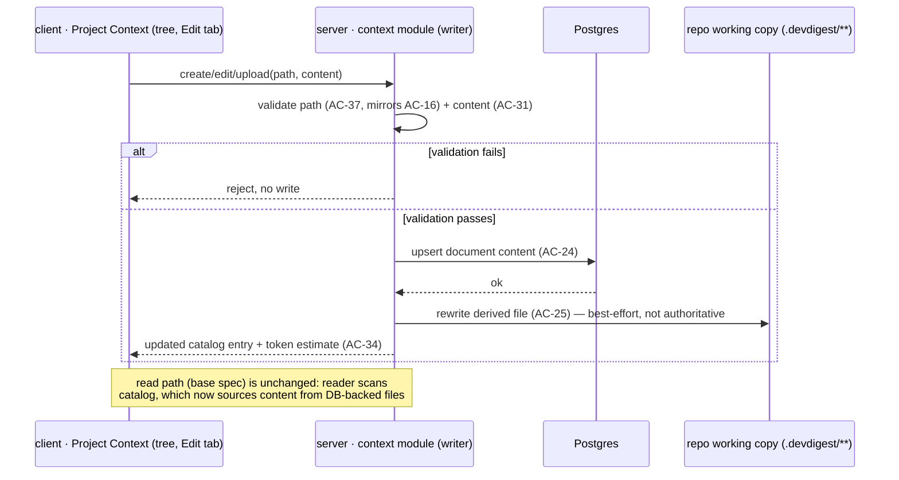

# Spec: Project Context Folder — Authoring | Spec ID: 2026-08-27-project-context-folder-authoring | Status: approved | Supersedes: specs/2026-08-26-project-context-folder.md

## Problem & why

The base spec (`2026-08-26-project-context-folder.md`) shipped the **Project
Context** page as read-only: browse, search, preview, attach. des1 shows more
than that — a folder tree, an **Edit** tab next to Preview, `+`/upload/folder
icons on the tree toolbar, and a "COVERAGE" ring on an open document — all of
which the base spec explicitly parked as Non-goals (open questions #3 and #9
in its Resolved clarifications).

This spec closes that gap: it turns the Project Context page from a *reader*
of `.devdigest/{specs,docs,insights}/**/*.md` into an *authoring surface* —
create, upload, and edit those documents from the UI — while keeping the
attach/inherit/inject/trace behavior of the base spec unchanged. It
**supersedes** the base spec's Non-goals bullet about the `+`/folder/upload
icons and the `Edit` tab, and its "COVERAGE ring — out of scope" resolved
clarification (#9); every other goal, AC, and decision in the base spec
still holds and is not restated here.

Because this spec adds a **write** path where the base spec had only reads,
it introduces a new attack surface — path traversal on write, upload
size/type, concurrent-edit races — symmetric to the read-side protections
the base spec built around AC-16. See `Untrusted inputs` and `Module
interactions` below.

## Goals / Non-goals

**Goals**

- Render the document catalog as a **folder tree** matching each document's
  repo-relative path under the configured search roots, instead of (or in
  addition to) the flat list from the base spec's AC-1.
- An **Edit** tab beside **Preview** on an open document: an editable
  markdown text area, saved on demand.
- A `+` action to **create** a new `.md` document at a chosen location under
  the search roots.
- A folder icon action to **create a new folder** (a path prefix) under the
  search roots, so documents can be organized before they exist.
- An **upload** action to bring in an existing local `.md` file, subject to a
  hard size limit and a content/extension check.
- Durable persistence of authored content: **Postgres is the source of
  truth**; the on-disk file under `server/clones/<repo>/.devdigest/**` is a
  derived projection, rewritten from the database when needed (e.g. after a
  resync or re-clone), and is **never committed or pushed to git**.
- A **COVERAGE** indicator on an open document: the percentage of the
  workspace's agents that have this exact document attached, directly or
  inherited via an enabled skill.
- Write operations use the **same authorization level as reads** — no new
  role check is introduced for create/edit/upload.

**Non-goals**

- **Delete.** Removing a document or folder from the tree is explicitly out
  of scope for this iteration; a future spec covers it. Detaching an
  attachment (already possible per the base spec) is unaffected.
- Any role- or permission-tier distinction between users who may read versus
  who may write documents — this spec inherits the existing single-access-
  level model wholesale; it does not add or design a permission system.
- Committing, pushing, or otherwise syncing the derived on-disk projection
  with the repository's own git history. Authored documents live in
  DevDigest's database, not in the target repository's git history.
- Real-time collaborative editing (OT/CRDT, live cursors, presence). Last
  write wins unless resolved otherwise below (see `[NEEDS CLARIFICATION]`).
- Renaming or moving an existing document/folder (distinct from delete, but
  carries the same "not this iteration" reasoning — no design work has gone
  into path-change effects on existing attachments).
- Version history / undo of past edits beyond what the database's normal
  row state provides — no diffing, no restore-a-previous-version UI.
- Any effect of authored content on `score`, `verdict`, or finding
  categories — unchanged from the base spec's Non-goals; this is still
  prompt context only, now with a write path added upstream of it.

## User stories

- **US-7**: as a reviewer, I want to browse documents as a folder tree that
  mirrors the repository's own layout, so I can navigate a large document set
  without scanning a flat list.
- **US-8**: as a document author, I want to edit a document's content
  directly on the Project Context page, so I can fix or extend project
  context without a separate git workflow.
- **US-9**: as a document author, I want to create a new document (and, if
  needed, a new folder to hold it) from the Project Context page, so I can
  add missing context without touching the repository directly.
- **US-10**: as a document author, I want to upload an existing local `.md`
  file, so I can bring in content I already have without retyping it.
- **US-11**: as an agent owner, I want to see what share of the workspace's
  agents use a given document (COVERAGE) before I edit or detach it, so I
  understand its blast radius.

## Acceptance criteria (EARS)

Numbering continues from the base spec, which ends at AC-23.

### Persistence model

- **AC-24 (US-8, US-9, US-10) — Verification: server-integration**: WHEN a
  document is created, uploaded, or edited through the UI, the system shall
  persist its content in Postgres, keyed by (repository, repo-relative
  path), as the **source of truth** for that content.
- **AC-25 (US-8) — Verification: server-integration**: WHEN the on-disk file
  under `server/clones/<repo>/.devdigest/**` is stale relative to the
  database (after an edit, or after the repository is resynced/re-cloned),
  the system shall rewrite it from the database before the reader's catalog
  scan (base spec AC-1/AC-2) treats it as current. The disk copy is a
  derived projection and is never treated as authoritative input.
- **AC-26 (US-8, US-9, US-10) — Verification: server-integration**: The
  system shall NOT stage, commit, or push the on-disk `.devdigest/**`
  projection to the target repository's git history as part of
  create/edit/upload — these documents live in DevDigest's own database,
  not in the reviewed repository's commits.

### Folder tree navigation

- **AC-27 (US-7) — Verification: client**: WHEN a user opens the Project
  Context page, the system shall render the catalog as a folder tree whose
  branches are the path segments of each document's repo-relative path under
  the configured search roots (`specs`/`docs`/`insights`), with documents as
  leaves.
- **AC-28 (US-7) — Verification: client** `[NEEDS CLARIFICATION: exact
  nesting depth and expand/collapse persistence are undefined by any source
  document — des1 shows at most two visible levels]`: The system shall
  support at least the nesting depth actually produced by documents under
  the search roots (arbitrary depth), rendering deeper paths as nested
  branches rather than flattening or truncating them.

### Create and upload

- **AC-29 (US-9) — Verification: server-integration**: WHEN a user creates a
  new document via the `+` action with a target folder and file name, the
  system shall accept it only if the resolved path is under one of the
  configured search roots, has the `.md` extension, and does not already
  exist; on success it shall create an empty (0-byte) document in the
  database and add it to the catalog.
- **AC-30 (US-9) — Verification: server-integration**: WHEN a user creates a
  new folder via the folder-icon action with a name and a parent location,
  the system shall register that path prefix as a browsable branch in the
  tree (AC-27) even before any document exists under it.
- **AC-31 (US-10) — Verification: server-unit**: WHEN a user uploads a file
  via the upload action, the system shall accept it only if **all** of the
  following hold: file size ≤ 1 MiB (1,048,576 bytes); the byte content
  decodes as valid UTF-8 text; and the file name's extension is exactly
  `.md`. If any check fails, the system shall reject the upload with an
  explicit reason and create no catalog entry — no partial or truncated
  document is stored.
- **AC-32 (US-10) — Verification: server-integration**: WHEN an uploaded
  file passes AC-31, the system shall persist its content the same way a
  created/edited document is persisted (AC-24) and add it to the catalog
  under the target path.

### Edit tab

- **AC-33 (US-8) — Verification: client**: WHEN a user switches an open
  document from **Preview** to **Edit**, the system shall show an editable
  markdown text area seeded with the document's current content.
- **AC-34 (US-8) — Verification: server-integration**: WHEN a user saves an
  edit, the system shall persist the new content as the document's content
  in the database (AC-24), recompute its token estimate (base spec AC-3),
  and make both available to the catalog and to any agent/skill that has
  this document attached — without requiring a new review run.
- **AC-35 (US-8) — Verification: server-integration** `[NEEDS
  CLARIFICATION: no source names a concurrency-control mechanism; the base
  spec's closest precedent (Edge cases, "concurrent editing of an agent's
  attachments") is last-write-wins with no conflict detection]`: The system
  shall, at minimum, apply **last-write-wins** semantics for concurrent edits
  of the same document from two sessions — a save shall not corrupt the
  document or crash the request. Whether a future iteration adds optimistic
  concurrency (an ETag/`updated_at` precondition that rejects a save based on
  stale content with a "reload and reapply" prompt) is left open.

### Write authorization

- **AC-36 (US-8, US-9, US-10) — Verification: server-integration**: The
  system shall authorize create/edit/upload requests using the same access
  check already applied to read and attach requests (base spec's existing
  single-workspace-access-level model) — no additional role or permission
  check gates these write operations beyond what already gates reads.

### Write-side path safety (symmetric to AC-16)

- **AC-37 (US-8, US-9, US-10) — Verification: server-unit**: WHEN a
  create/upload/edit request specifies or implies a target path, the system
  shall reject it unless the resolved path is absolute-free, contains no
  `..` segments, resolves inside one of the configured search roots, is not
  a symlink, and (for create/upload) ends in `.md` — mirroring, on the write
  side, the same rule AC-16 already applies on the read side. A path failing
  this check shall be rejected before any file-system or database write is
  attempted.
- **AC-38 (US-9, US-10) — Verification: server-unit**: The system shall
  reject a create/upload/folder-create request whose target path collides
  with an existing node of the other kind (a document path that already
  names a folder, or vice versa) rather than silently overwriting or
  merging the two.

### COVERAGE indicator

- **AC-39 (US-11) — Verification: client**: WHEN a user opens a document
  (Preview or Edit), the system shall show a COVERAGE value computed as
  `(number of workspace agents with this exact document attached, directly
  or inherited via an enabled skill) / (total number of agents in the
  workspace) × 100`, displayed as the ring shown on des1. This is a
  **document-level** metric, distinct from the base spec's per-run
  `specs_read`/trace transparency and from the catalog-wide "Used by N
  agents" badge (base spec AC-23) — COVERAGE is a percentage of the
  workspace, AC-23's badge is a raw count.
- **AC-40 (US-11) — Verification: client**: IF the workspace has zero
  agents, THEN the system shall show an explicit "no agents in this
  workspace" state for COVERAGE rather than `0%` or a division-by-zero
  error.

### Refresh

- **AC-41 (US-7) — Verification: client** `[NEEDS CLARIFICATION: no source
  document defines what the refresh icon on des1 actually re-reads]`: The
  system shall, at minimum, make the refresh action re-run the catalog scan
  (base spec AC-1) against current database content plus any on-disk drift
  (AC-25), so a document created/edited in another tab or session becomes
  visible without a full page reload. Whether it additionally forces a
  repository re-clone/resync is left open.

## Edge cases

- A folder created via the folder icon (AC-30) with no document ever added
  under it → remains a browsable empty branch in the tree; not automatically
  pruned.
- A document created via `+` (AC-29) and never edited → a 0-byte document,
  same as the base spec's "empty `.md`" edge case: attachable, 0-token
  estimate, empty untrusted block on insertion.
- An upload whose name collides with an existing document at that path →
  rejected as a normal "already exists" conflict (AC-29's existence check
  applies to uploads too), not a silent overwrite.
- Editing a document that is currently attached to one or more agents/skills
  → the edit takes effect for the **next** run; a run already in flight (or
  already recorded in a trace) is unaffected — the base spec's `specs_read`
  is a record of what was read at that run's time, not a live view.
- A resync/re-clone of the repository while authored documents already exist
  in the database → AC-25 rewrites the on-disk projection from the database;
  the resync does not delete or overwrite the database's copies.
- COVERAGE recomputed while an attach/detach happens concurrently in another
  tab → the value shown is a snapshot as of the document-open request, same
  staleness tolerance as the base spec's AC-23 "Used by N agents" badge.
- A write request for a path outside the search roots, or with a `..`
  segment, or naming a symlink → rejected per AC-37, same as the read-side
  AC-16 rejects it before ever reaching disk.

## Non-functional

- **Security (write path safety)** — see `Untrusted inputs` below; every
  create/edit/upload request's target path is validated per AC-37 before any
  write; Verification: server-unit.
- **Security (upload content)** — a hard 1 MiB size ceiling and a UTF-8
  validity check on every upload (AC-31); no binary content, no encoding
  guesswork. Verification: server-unit.
- **Write authorization parity** — write endpoints must not silently gain a
  stricter or looser check than the existing read/attach endpoints (AC-36).
  Verification: server-integration.
- **Data durability** — Postgres, not the working-copy file, is the
  authoritative store (AC-24); a lost or corrupted clone directory must not
  lose authored content. Verification: server-integration.
- **Cost transparency** — an edited document's token estimate must update
  immediately (AC-34), consistent with the base spec's pre-run cost
  transparency requirement. Verification: client.
- **A11y** — the folder tree is keyboard-navigable (expand/collapse, select)
  and the Edit tab's text area is a standard focusable, labeled control; no
  keyboard trap. Verification: manual-qa.

## Inputs (provenance)

| Input | Provenance |
|---|---|
| document content (create/edit/upload) | `[user: submitted through the Project Context UI]` — untrusted at write time (path + bytes) and untrusted at prompt-insertion time (base spec's existing rule) |
| target path for create/upload/folder-create | `[user: chosen in the UI]` — validated against the search roots before any write (AC-37), mirroring AC-16's read-side rule |
| document content, source of truth | `[deterministic: Postgres row for (repository, path), written by this spec's write path]` — supersedes the base spec's "file read from the working copy" for authored documents |
| on-disk `.devdigest/**` projection | `[derived: rewritten from Postgres on drift, AC-25]` — never authoritative |
| COVERAGE percentage | `[deterministic: count of workspace agents with the document attached (directly or via enabled skill) ÷ total workspace agents, computed at document-open time]` |

## Untrusted inputs

The base spec already treats document **content** as untrusted at prompt-
insertion time (its `Untrusted inputs` section, AC-15/AC-16). This spec adds
a **write** path that did not previously exist, and treats it with the same
seriousness:

- A target **path** submitted from the client for create/upload/edit is
  untrusted input to a file/database write operation, exactly as a read
  path is untrusted input to a file read (base spec AC-16). AC-37 is this
  spec's mandatory, non-optional mirror of AC-16 on the write side:
  absolute paths, `..` segments, symlinks, non-`.md` extensions, and paths
  outside the configured search roots are rejected before any write is
  attempted.
- Uploaded **bytes** are untrusted input twice over: as a file (size and
  encoding must be validated per AC-31 before storage) and, once stored, as
  document content that will later be inserted into a prompt verbatim under
  the base spec's existing untrusted-delimiter mechanism (base spec AC-12,
  AC-13). Passing AC-31 does not make the content trusted for prompt
  purposes — it only makes it a legitimately stored document.
- An edited document can, in principle, be used to smuggle a prompt
  injection into a document an agent already trusts by convention (e.g. an
  invariants file). This spec does not add content scanning or an approval
  workflow for edits — the base spec's `INJECTION_GUARD` remains the single
  defense at insertion time, unchanged and not duplicated here (base spec's
  "no denylists, regexes, or keyword scanning over document text" still
  applies to edited/uploaded content).
- Concurrent edits are a race on a shared row, not a security boundary; the
  authorization model (AC-36) does not attempt to distinguish "my edit"
  from "someone else's edit" beyond last-write-wins (AC-35).

## Module interactions

| Module A | Module B | Contract and direction |
|---|---|---|
| `client/` (Project Context tree, Edit tab, upload/create dialogs) | `server/` | REST: create/edit/upload document; create folder; read COVERAGE. Direction — client → server only, same as the base spec's read/attach calls |
| `server/` (writer) | Postgres | document content is written and read back as source of truth (AC-24); this is new relative to the base spec, which had no writer |
| `server/` (writer) | repository working copy | rewrites the derived `.devdigest/**` projection from the database (AC-25); never reads this projection as authoritative |
| `server/` (writer) | the base spec's reader/catalog | the writer's path-validation rule (AC-37) reuses the same search-roots/catalog logic the reader already enforces for AC-16 — one shared rule, two directions (read vs. write), not two independent implementations |
| `server/` (COVERAGE) | agent/skill attachment store | reused from the base spec's AC-11 merge logic (agent ∪ enabled skills' documents), aggregated across all workspace agents instead of resolved for one run |

Ring placement: the writer (path validation + DB write + derived-projection
rewrite) is infrastructure/application, same ring as the base spec's reader;
no change to `reviewer-core`, which still only ever receives already-resolved
strings via `ReviewInput.specs` and has no awareness that a document's
content can now be authored in-app rather than committed to the repository.

## Proposed UX improvements

These are **proposals**, not design decisions:

1. **Surface "derived, not git" explicitly in the UI.** Because authored
   content lives in Postgres and is never committed (AC-26), a user who
   expects a normal git-backed file could be surprised it doesn't show up in
   `git diff`. Proposal: a small persistent label on the Project Context
   page ("stored in DevDigest, not in this repository's git history").
2. **Show COVERAGE and "Used by N agents" (base spec AC-23) side by side**,
   since they answer related but distinct questions (percentage vs. raw
   count) and des1 places COVERAGE where a reader could mistake it for a
   restatement of the badge.
3. **Warn before editing a widely-attached document.** If COVERAGE is high,
   a save could quietly change context for many agents at once; a
   confirmation step ("this document is used by N of M agents") would make
   that blast radius visible before the save, not just after via COVERAGE.

## Traceability

| User story | Acceptance criteria |
|---|---|
| US-7 | AC-27, AC-28, AC-41 |
| US-8 | AC-24, AC-25, AC-26, AC-33, AC-34, AC-35, AC-36, AC-37 |
| US-9 | AC-24, AC-26, AC-29, AC-30, AC-36, AC-37, AC-38 |
| US-10 | AC-24, AC-26, AC-31, AC-32, AC-36, AC-37, AC-38 |
| US-11 | AC-39, AC-40 |

## Resolved clarifications

All five items below were put to the user as blocking questions and received
an explicit answer; the decisions are already reflected in the ACs above —
this list remains only as a log of the decisions made.

1. **Git persistence (AC-24, AC-25, AC-26)** — local-only plus a durable
   copy in the database: Postgres is the source of truth for authored
   content; the on-disk file under `server/clones/<repo>/.devdigest/**` is a
   derived projection, rewritten from the database when it drifts (e.g.
   after a resync/re-clone), and is never committed or pushed to git.
2. **Write authorization (AC-36)** — the same access level as reading:
   the existing single-workspace-access-level model applies unchanged to
   create/edit/upload; no new role check is introduced.
3. **COVERAGE formula (AC-39)** — a document-level metric shown in the
   context of an open document: `(workspace agents with this exact document
   attached, directly or via an enabled skill) / (all agents in the
   workspace) × 100`.
4. **Upload limits (AC-31)** — a hard 1 MiB (1,048,576-byte) size ceiling,
   named explicitly as a non-functional requirement, plus a UTF-8 text
   validity check and a strict `.md` extension requirement.
5. **Delete** — explicitly out of scope for this iteration (see
   Non-goals); a future spec will cover deleting a document or folder.

## Open `[NEEDS CLARIFICATION]` items

Left inline above, listed here for visibility; none of them block this
spec's other acceptance criteria:

- **AC-28** — exact folder-tree nesting depth and expand/collapse
  persistence behavior beyond "supports arbitrary depth."
- **AC-35** — whether a future iteration adds optimistic concurrency
  (ETag/`updated_at` precondition) on top of the last-write-wins baseline
  for concurrent edits of the same document.
- **AC-41** — the exact scope of the refresh icon: catalog-only re-scan, or
  also a forced repository resync/re-clone.
