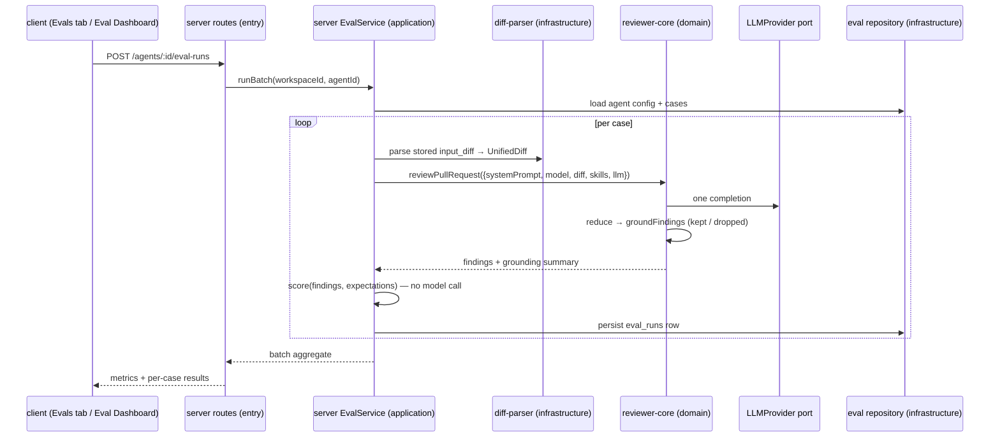

# Spec: Eval Pipeline | Spec ID: 2026-08-29-eval-pipeline | Status: approved
Readiness: zero open questions — every `[NEEDS CLARIFICATION]` has been resolved
and recorded as a decision at the acceptance criterion it affects. Ready to hand
to `implementation-planner`.

## Problem & why

Changing a review agent's system prompt, model, or linked skills today produces
no measurable signal. The only feedback is a human reading the next review and
guessing whether it got better. Meanwhile the studio already collects the exact
ground truth needed to measure it: every finding a user **accepted** is a
true positive the agent must keep producing, and every finding a user
**dismissed** is noise it must stop producing.

The Eval Pipeline turns those decisions into a persisted gold set, replays the
agent over that frozen set on demand, and scores the result **mechanically** —
no judge model, no second LLM call. Two runs of the same set under two agent
configurations are then directly comparable, which is what makes "did this
prompt change help or break the agent?" answerable with numbers.

## Goals / Non-goals

Goals:

- Persist eval cases (`eval_cases`) derived from real findings, with frozen
  inputs (diff / files / PR meta) so a case survives the PR moving on.
- Two expectation types: `must_find` (the agent shall report a finding at
  `file:line`) and `must_not_flag` (the agent shall report nothing there).
- One route that replays an agent over its whole case set and persists one
  scored row per case plus one batch record.
- Deterministic, code-only scoring producing `recall`, `precision`,
  `citation_accuracy`, and a pass/fail per case.
- **The complete UI surface of the supplied design is in scope** — nothing is
  deferred: the `Turn into eval case` action on `FindingCard`; the case modal in
  both its positive and negative variants; the `Evals` tab in the agent editor;
  the `Eval Dashboard` sidebar entry with the agent list and the global
  `Recent runs` table; the per-agent dashboard page with `METRIC TREND`; and the
  `Compare runs` popup with the system-prompt diff and `Promote`.

Non-goals:

- **No LLM-as-judge.** The scorer performs zero model calls. A rationale-quality
  or "is this the same issue semantically" judgement is out of scope.
- No editing of the agent from the eval screens beyond the explicit `Promote`
  action described in AC-29.
- No CI integration, no scheduled/automatic eval runs, no export of eval results
  to GitHub — those belong to later lessons.
- No eval cases owned by a **skill**. `eval_cases.owner_kind` already admits
  `'skill'`; this spec covers `owner_kind = 'agent'` only, and the API shall
  reject `'skill'` until a later lesson defines it.
- No cross-workspace or shared/public gold sets.
- No re-derivation of a case when the underlying finding or PR later changes.

## User stories

- **US-1**: as a reviewer, I want to turn a finding I just accepted or dismissed
  into an eval case in one click, so that building the gold set costs me nothing
  beyond the triage I already do.
- **US-2**: as an agent owner, I want to see every eval case in my agent's set
  with its expectation type and last result, so that I know what the agent is
  being held to.
- **US-3**: as an agent owner, I want to replay the agent over the whole set with
  one action, so that I get a comparable measurement after any config change.
- **US-4**: as an agent owner, I want recall, precision and citation accuracy for
  a run, so that I can tell improvement from regression numerically.
- **US-5**: as an agent owner, I want run history and a side-by-side comparison of
  two runs including the system-prompt diff, so that I can attribute a metric
  movement to a specific configuration change.
- **US-6**: as a maintainer of several agents, I want one dashboard listing every
  agent's latest eval standing, so that I can spot which agent regressed without
  opening each one.
- **US-7**: as an agent owner, I want to promote the configuration behind a
  better run back onto the agent, so that reverting a bad prompt change does not
  mean retyping it.
- **US-8**: as a course reviewer, I want one command that verifies the acceptance
  criteria of this lesson, so that grading is mechanical.

## Acceptance criteria (EARS)

### Authoring cases

**AC-1 (US-1) — Verification: client**: WHEN a finding is rendered in a review
run's findings block, the system shall display a `Turn into eval case` action
alongside `Accept` and `Dismiss`.

**AC-2 (US-1) — Verification: client**: WHEN the user activates
`Turn into eval case` on a finding whose `accepted_at` is set, the system shall
open the eval-case editor pre-seeded with expectation type `must_find` and an
`expected_output` containing exactly one entry carrying that finding's `file`,
`start_line`, `end_line`, `severity`, `category` and `title`.

**AC-3 (US-1) — Verification: client**: WHEN the user activates
`Turn into eval case` on a finding whose `dismissed_at` is set, the system shall
open the editor pre-seeded with expectation type `must_not_flag` and
`expected_output` equal to `[]`.

**AC-4 (US-1) — Verification: client**: IF the finding has neither `accepted_at`
nor `dismissed_at`, THEN the system shall keep the `Turn into eval case` action
disabled and explain that the finding must be accepted or dismissed first.
(Decided: the expectation type is *derived* from the triage decision — see
`Inputs (provenance)` — so an untriaged finding carries no decision to encode.
Letting the user pick the type by hand would create a second, divergent source
of truth for the same field.)

**AC-5 (US-1) — Verification: server-integration**: WHEN an eval case is created,
the system shall persist the unified diff, the file list and the PR meta of the
originating pull request into `eval_cases.input_diff` / `input_files` /
`input_meta` as a frozen copy, and shall not read the live pull request at run
time.

**AC-6 (US-1) — Verification: server-unit**: The system shall persist each case's
expectation type as a **first-class, closed-set column** on `eval_cases` with the
values `must_find` and `must_not_flag`, and shall expose it as a matching field
on the `EvalCase` / `EvalCaseInput` contracts in **both** vendored `shared`
copies. It shall not infer the type from `expected_output` being empty.
(Decided: the repo's established shape for a closed set is a
`text(..., { enum })` column — `agents.strategy`, `agents.ci_fail_on`,
`eval_cases.owner_kind` — not a flag buried in a `jsonb` document; a `jsonb`
field would be unqueryable and unvalidated at the DB level, and the
`X/Y passing` and badge reads in AC-10 filter on it.)

**AC-7 (US-1) — Verification: server-integration**: IF `expected_output` is not
valid JSON matching the expected-findings contract, THEN the system shall reject
the create/update with `400` and shall not persist a partial case.

**AC-8 (US-1) — Verification: client**: WHILE the editor's `expected_output` text
is not parseable JSON, the system shall mark the field invalid and keep `Save`
and `Run case` disabled.

**AC-9 (US-1) — Verification: client**: WHERE `Run on save` is enabled in the
editor, the system shall run the case immediately after a successful save and
render the result into the read-only `Actual output` field; otherwise that field
shall read `Never run yet` until the case has been run at least once.

**AC-10 (US-2) — Verification: client**: WHEN the `Evals` tab of the agent editor
is opened, the system shall list every case owned by that agent showing its name,
a `MUST FIND` / `MUST NOT FLAG` badge, `expected N finding(s), got M · recall X%`
from its most recent run, and `Run` / `Edit` / `Delete` actions.

**AC-11 (US-2) — Verification: client**: WHILE the agent has no eval cases, the
system shall render an empty state inviting case creation and shall not render
metric cards computed from zero cases.

### Running

**AC-12 (US-3) — Verification: server-integration**: WHEN
`POST /agents/:id/eval-runs` is called, the system shall execute the agent over
every case in that agent's set, persist one `eval_runs` row per case, and return
the batch's aggregate metrics.

**AC-13 (US-3) — Verification: server-integration**: WHEN a batch is executed,
the system shall persist an explicit batch identity and record against it the
agent `version` in force at execution time; every `eval_runs` row shall carry the
identity of the batch it belongs to, and the system shall not reconstruct a batch
by grouping rows on timestamp proximity.
(Decided: this schema/contract extension is **in scope**. `eval_runs` today has
only `case_id`; without batch identity and a recorded `version`, AC-26, AC-28,
AC-29 and AC-30 have nothing to attribute a metric movement to and the feature
collapses. The repo already models "a run and its rows" as two tables —
`reviews`/`findings`, `agents`/`agent_versions` — so a parent record is the
established shape, not an invention.)

**AC-14 (US-3) — Verification: server-integration**: WHEN a case is executed, the
system shall build the review input from the case's stored diff — never from a
live GitHub or git read — so that the same case yields comparable inputs across
batches.

**AC-15 (US-3) — Verification: server-integration**: IF one case fails to execute
(provider error, timeout, unparseable diff), THEN the system shall persist that
case's row as failed with `pass = false` and shall continue with the remaining
cases rather than aborting the batch.

**AC-16 (US-3) — Verification: server-integration**: IF the agent has fewer than
one case, THEN `POST /agents/:id/eval-runs` shall respond `400` and persist
nothing.

**AC-17 (US-8) — Verification: server-integration**: The system shall carry at
least 8 eval cases for the demonstration agent in seed data, covering both
expectation types.

### Scoring

**AC-18 (US-4) — Verification: server-unit**: The system shall compute
`recall`, `precision` and `citation_accuracy` without performing any LLM call —
the scorer takes findings and expectations as data and returns numbers.

**AC-19 (US-4) — Verification: server-unit**: The system shall count a produced
finding as matching an expectation when the `file` strings are equal **and** the
inclusive ranges `[start_line, end_line]` intersect by at least one line; no
tolerance band, no overlap ratio threshold, and no partial credit shall apply,
and no other field (`severity`, `category`, `title`, `confidence`) shall affect
matching.
(Decided: bare overlap is this repo's deliberate simplification. Prior art —
IoU thresholds in object detection, ±N-line tolerances in code-review harnesses —
buys precision at the cost of a tunable nobody can justify on a set of ~8 cases,
and `severity`-sensitive matching would make the metric move when the agent is
merely more cautious. It also mirrors the range-intersection rule the grounding
gate already uses in `reviewer-core/src/grounding.ts`, so the two mechanical
gates in this feature agree on what "same location" means.)

**AC-20 (US-4) — Verification: server-unit**: The system shall assign produced
findings to expectations **one-to-one**: an expectation shall be consumed by at
most one finding, and a finding shall satisfy at most one expectation. Surplus
findings overlapping an already-matched expectation shall count as unmatched.
(Established prior art — COCO-style greedy assignment, span-matching harnesses —
counts duplicate overlapping predictions as false positives rather than as
additional true positives; without this rule precision is inflated.)

**AC-21 (US-4) — Verification: server-unit**: The system shall compute `recall`
as the share of `must_find` expectations that were matched, and `precision` as
the share of produced findings that matched an expectation, with `must_not_flag`
cases contributing every produced finding as unmatched and contributing **no**
expectations to the recall denominator.

**AC-22 (US-4) — Verification: server-unit**: IF a metric's denominator is zero
(no expectations to recall, or no findings produced), THEN the system shall
record that metric as `null` for that case and shall exclude the case from the
metric's batch average; it shall not substitute `0` or `1`.
(Decided. `scikit-learn` exposes this as an explicit `zero_division` parameter
precisely because no convention settles it, so the repo picks one and records it
here. Substituting `0` would let a correctly-silent `must_not_flag` case drag
precision down; substituting `1` would score silence as perfect. `null` +
exclusion says the honest thing — that case measured nothing for this metric.)

**AC-23 (US-4) — Verification: reviewer-core**: The system shall compute
`citation_accuracy` as `kept / (kept + dropped)` from the existing citation
grounding gate (`reviewer-core/src/grounding.ts`, `groundFindings`) applied to
the case's stored diff — the same gate the live review pipeline runs, not a
re-implementation.

**AC-24 (US-4) — Verification: server-unit**: The system shall additionally
compute, over `must_not_flag` cases only, the share of those cases on which the
agent produced no finding at all, expose it in the batch API response and in the
per-case result detail, and shall **not** add it as a fifth card to the metrics
row.
(Decided: static-analysis benchmarking reports a false-positive rate separately
from precision, because a pooled precision hides which side the noise came from —
so the number is worth computing. But the design fixes the metrics row at four
cards (Recall / Precision / Citation Accuracy / Traces Passed), and a spec may
not quietly widen a settled layout; the number lives in the API and the detail
view, where a later lesson can promote it.)

**AC-25 (US-4) — Verification: server-unit**: The system shall mark a case as
passing when every `must_find` expectation of that case was matched and no
unmatched finding was produced for a `must_not_flag` case, and shall surface the
count as `X/Y passing`.

**AC-26 (US-4) — Verification: server-unit**: The system shall aggregate per-case
metrics into the batch figure by **macro-averaging** — score each case, then take
the unweighted mean over the cases that have a value for that metric (AC-22) —
and shall apply that rule identically to every batch.
(Decided. Every case here is authored by hand as a regression test, so each one
weighs the same; micro-averaging — pooling all matched/unmatched counts and
computing once — would let a case carrying ten expectations drown out a case
carrying one. No LLM-eval framework documents a settled convention for gold sets
of this size, so the rule is fixed here rather than inherited.)

### History, comparison, promotion

**AC-27 (US-5) — Verification: client**: WHEN the user selects exactly two
batches in the agent's run history, the system shall enable `Compare`; WHILE the
selection is not exactly two, `Compare` shall stay disabled.

**AC-28 (US-5) — Verification: client**: WHEN two batches are compared, the
system shall show the signed delta of `recall`, `precision`, `citation_accuracy`
and cost between them, and a textual diff of the two agent versions'
`system_prompt` taken from the `agent_versions` snapshots.

**AC-29 (US-7) — Verification: server-integration**: WHEN the user promotes a
batch's agent version, the system shall restore that version's configuration
snapshot onto the agent as a **new** version, leaving `agent_versions` immutable
and append-only: promoting `v7` shall leave the agent at a **new** `v8` whose
configuration equals `v7`'s snapshot, and shall never rewind `agents.version`.
The write shall go through the agents service so the existing version-bump
invariant runs.
(Decided by existing code: `server/src/modules/agents/repository.ts` snapshots
every config-affecting change into `agent_versions` and monotonically increments
`agents.version`. Rewinding would either overwrite an immutable snapshot or make
`version` non-monotonic, and every eval batch already recorded against `v7` would
silently start pointing at two different configurations.)

**AC-30 (US-5) — Verification: client**: WHILE an agent has run at least two
batches, the system shall render a metric trend chart with one line per metric
over the batches in chronological order.

**AC-31 (US-6) — Verification: client**: WHEN the `Eval Dashboard` navigation
item is opened, the system shall list every agent in the workspace with its model
badge, and — for an agent with no batches — a `Configure eval cases →` link
instead of metrics.

**AC-32 (US-6) — Verification: client**: WHEN the dashboard is opened, the system
shall render a `Recent runs` table across all agents with agent, case, date,
version, recall, precision, citation and pass columns.

**AC-33 (US-6) — Verification: client**: WHERE the latest batch's precision fell
relative to the previous batch of the same agent, the system shall render an
alert banner on that agent's dashboard page naming the metric and the delta.

### Isolation and verification

**AC-34 (US-3) — Verification: server-integration**: The system shall scope every
eval case, batch and dashboard read to the caller's workspace, and shall respond
`404` for an `agent_id` or `case_id` belonging to another workspace.

**AC-35 (US-8) — Verification: server-unit**: `pnpm verify:l06` shall exit
non-zero unless: the seeded agent has ≥ 8 cases, both expectation types are
represented, a batch can be scored end-to-end against a stubbed provider, and the
scorer module performs no provider call. The script shall be owned by `server/`,
since every artefact it asserts on (seed data, the batch route, the scorer) lives
there.
(Decided: the repo has no top-level runner — `CLAUDE.md` states tests are one
suite per package and per-package commands live in that package's `AGENTS.md`, so
a root-level `verify:l06` would be the first of its kind. Implementation note,
not a requirement: `server/package.json` may carry the local `skip-worktree`
flag, so the script has to actually reach the commit.)

## Edge cases

- A finding is turned into a case twice — the second attempt shall be rejected or
  produce a distinct case; silent duplication would double-count that expectation
  in recall.
- The originating finding, review, or pull request is deleted afterwards. The
  case must survive: its inputs are a frozen copy, and it holds no FK to
  `findings`.
- An accepted finding is later dismissed (or vice versa). The already-created
  case does **not** change expectation type; the gold set is a snapshot of the
  decision at creation time.
- A case whose stored diff no longer parses (truncated paste, hand-edited diff) —
  the grounding gate would drop every finding and report `citation_accuracy` 0,
  which is indistinguishable from a genuinely ungrounded agent. AC-15 requires
  this to surface as a failed case, not as a metric.
- Two produced findings both overlapping one `must_find` expectation — AC-20's
  one-to-one assignment is what keeps this from inflating precision.
- An expectation and a produced finding that overlap by a single line at the
  edge of a large range — under AC-19 this is a full match, with no tolerance
  band and no partial credit.
- A `must_find` expectation whose lines lie outside every hunk of the stored
  diff: the grounding gate drops the correct finding before scoring, so recall
  can never reach 1 for that case. The editor should warn at authoring time.
- A batch run while a previous batch for the same agent is still running — the
  second batch's `agent_version` may differ mid-flight if the agent is edited
  concurrently.
- The agent is deleted while it owns cases: `eval_cases.owner_id` is a plain
  `uuid` with **no** foreign key (the column is polymorphic), so cascade delete
  does not apply — the agents service deletes them explicitly, see
  `Module interactions`.
- A `must_not_flag` case on which the agent produces zero findings — the correct
  outcome — must not divide by zero in precision.
- Cost: a batch over 8+ cases is 8+ provider calls. Repeated `Run all agents` on
  the dashboard multiplies that across every agent.

## Non-functional

- **Determinism — Verification: server-unit**: given the same findings and
  expectations, the scorer shall return byte-identical metrics across
  invocations; it shall not read the clock, the network, or the database.
- **Cost visibility — Verification: client**: the system shall display the
  batch's aggregate `cost_usd` in run history, since a batch is the most
  expensive user-triggered action in the studio.
- **Responsiveness — Verification: server-integration**: `POST
  /agents/:id/eval-runs` shall return the batch identity immediately and report
  progress and completion over the existing run-event channel, rather than
  holding the HTTP request open for the whole batch.
  (Decided by existing code and by arithmetic: a batch over ≥ 8 cases is ≥ 8
  provider calls — minutes, not seconds, and past any reasonable proxy timeout.
  The repo already owns exactly this machinery for review runs: a `run_id`
  created up-front, `RunBus`, SSE subscription and cancellation
  (`modules/reviews/run-executor.ts`). Reusing it also gives cancellation and the
  design's `Running…` state for free; a synchronous `POST` has no precedent here
  for any multi-call operation.)
- **Security — Verification: server-integration**: eval-case text is
  user-authored and is fed to a model; see `Untrusted inputs`.
- **Accessibility — Verification: manual-qa**: metric deltas shall not be
  conveyed by arrow colour alone; the sign shall be present in the text.

## Inputs (provenance)

| Input | Provenance |
|---|---|
| `file`, `start_line`, `end_line`, `severity`, `category`, `title` of the expectation | [reused: L01–L05] copied from the `findings` row at case-creation time |
| expectation type | [deterministic: `accepted_at` set → `must_find`; `dismissed_at` set → `must_not_flag`] |
| `input_diff`, `input_files`, `input_meta` | [reused: L01–L05] frozen copy of the originating PR's parsed diff and metadata |
| agent `system_prompt`, `model`, `strategy`, linked skills | [reused: L01–L05] read from `agents` / `agent_versions` / `agent_skills` at batch time |
| produced findings | agent output for the batch — model-generated, untrusted |
| `citation_accuracy` | [deterministic: `groundFindings` over the case's stored diff] |
| `recall`, `precision`, `pass` | [deterministic: code-only matching per AC-19/AC-20] |
| `cost_usd`, `duration_ms` | [reused: L01–L05] the existing per-run usage accounting |

## Untrusted inputs

Two distinct untrusted surfaces reach this feature, and both are **data, never
instructions**:

1. **The stored case diff and PR meta.** These originate from a third party's
   pull request and are hand-editable in the case editor afterwards. They are fed
   into the prompt through the same path the live review uses, so they shall be
   wrapped by `reviewer-core`'s existing untrusted-content handling and covered
   by the single `INJECTION_GUARD`. The eval path shall not introduce a second,
   unwrapped way of getting text into the prompt — that would be a prompt-
   injection surface that the live review does not have.
2. **The model's produced findings.** `file`, `title` and `rationale` are
   model-generated strings. They are persisted into `eval_runs.actual_output` and
   rendered in the UI; they shall be escaped as data (React's default escaping —
   no `dangerouslySetInnerHTML` on this path) and shall never be interpolated
   into a SQL string or a filesystem path. `file` in particular must not be used
   to read from disk during scoring: matching is string comparison only.

Authorization: every eval route is workspace-scoped (AC-31). An eval case
identifier is a uuid belonging to a workspace; reading or running a case by id
without the workspace check would be an IDOR across tenants. `Promote` (AC-26)
mutates agent configuration and shall be subject to the same authorization as
`PUT /agents/:id`, not a weaker one, because it is an agent write reached from a
metrics screen.

## Module interactions

- **Already present in the repo** (so this spec constrains their use rather than
  their invention): the `eval_cases` / `eval_runs` tables (`0000_init.sql`), the
  `EvalCase` / `EvalRun` contracts in `vendor/shared/contracts/knowledge.ts` and
  the API shapes in `contracts/eval-ci.ts` (both vendored copies), the
  `client/messages/en/eval.json` strings, and agent config versioning
  (`agents.version` + `agent_versions`). Missing entirely: any server module, any
  client screen, and the batch/expectation-type fields named above.
- **client → server**: new REST surface under `/agents/:id/eval-cases`,
  `/agents/:id/eval-runs`, plus a workspace-wide dashboard read. Client access
  goes through `lib/hooks/*` → `lib/api.ts` only. Failure modes the client must
  render: API unreachable (`ApiError` `status: 0`), `400` on an empty case set,
  and a batch that returns with some cases failed.
- **server → reviewer-core**: the eval path calls the same
  `reviewPullRequest` entry point the live review uses, but assembles its
  `ReviewInput` from stored data. `reviewer-core` stays pure — it receives a
  parsed `UnifiedDiff` and resolved skill bodies, never a case id.
- **Scorer placement — decided**: the scorer is a pure module in the server's
  **application ring** (`modules/eval/`), a plain function over
  `(findings, expectations) → metrics` that is constructed with no ports at all.
  It does **not** go in `reviewer-core/`: that package's stated contract is the
  review engine `diff → prompt → LLM → grounded findings`, shared verbatim with
  the CI runner, and eval semantics have no business in the CI runner's surface.
  Injecting no `LLMProvider` into the scorer is what makes AC-18 structurally
  true rather than merely observed at test time. `citation_accuracy` is the one
  exception and stays in `reviewer-core` — it is `groundFindings`, which already
  lives there (AC-23).
- **server → LLM provider**: reached through the container's `llm()` port, as
  every other module does. The scorer itself must not receive that port at all —
  that is how AC-18 stays structurally true rather than merely observed.
- **server → diff parsing**: the case stores diff *text*, the engine wants a
  `UnifiedDiff`; the existing `adapters/git/diff-parser.ts` is the only sanctioned
  path, and it is infrastructure — the service depends on it through the
  container, not by importing the adapter class.
- **eval ↔ agents module**: read of `agents` / `agent_versions` for the batch's
  version snapshot and the prompt diff; write of the agent config on `Promote`.
  That write shall go through the agents service, not through the eval
  repository, or the version-bump invariant in `agents/repository.ts` is
  bypassed.
- **Agent deletion — decided**: `eval_cases.owner_id` is polymorphic
  (`owner_kind` ∈ `skill | agent`) and therefore cannot carry a foreign key, so
  cascade delete does not apply. The agents service shall delete an agent's eval
  cases (and, by cascade, their runs) in the same transaction as the agent, so
  the invariant lives next to the delete it guards rather than in a cleanup job.
- **e2e — decided**: the `e2e` lane shall cover only the provider-free part of
  the flow — turning a triaged finding into a case, and seeing that case in the
  agent's `Evals` tab. Scoring correctness belongs to `server-unit` (it is a pure
  function), and the two-prompt acceptance experiment stays `manual-qa`, because
  driving it through the browser would spend real provider budget on every CI
  run of `./scripts/e2e.sh`.

## Proposed UX improvements

These are **proposals**, not decisions, and none of them appear in the supplied
screenshots:

- **Warn at authoring time when an expectation cannot be grounded.** If the
  expectation's lines do not intersect any hunk in the stored diff, recall for
  that case is capped at 0 no matter how good the agent is. Catching this in the
  editor closes the gap where a user builds a gold set that is unpassable by
  construction.
- **Show which findings matched which expectation in the run result**, not only
  the aggregate percentage. Today the case row says `recall 50%`; it does not say
  *which* expectation was missed, which is the first thing anyone asks.
- **Confirm before `Run all agents`.** It is the single most expensive action in
  the product (agents × cases provider calls) and currently has no
  confirmation and no cost estimate. Closes the gap of an irreversible spend
  triggered by one click.
- **Make `Promote` show what it will change before it applies.** The compare
  popup already renders the prompt diff; reusing it as the confirmation body
  turns an agent-config mutation reached from a metrics screen into an explicit
  choice.
- **Label a case whose originating finding was later re-triaged.** The gold set
  deliberately does not follow the finding, but silently disagreeing with the
  current triage state is confusing; a passive marker resolves it without
  changing semantics.

## Traceability

| User story | Acceptance criteria |
|---|---|
| US-1 | AC-1, AC-2, AC-3, AC-4, AC-5, AC-6, AC-7, AC-8, AC-9 |
| US-2 | AC-10, AC-11 |
| US-3 | AC-12, AC-13, AC-14, AC-15, AC-16, AC-34 |
| US-4 | AC-18, AC-19, AC-20, AC-21, AC-22, AC-23, AC-24, AC-25, AC-26 |
| US-5 | AC-27, AC-28, AC-30 |
| US-6 | AC-31, AC-32, AC-33 |
| US-7 | AC-29 |
| US-8 | AC-17, AC-35 |

## [NEEDS CLARIFICATION]

**None open.** Every question raised while drafting has been resolved and written
into the spec as a decision, with its justification inline at the criterion it
governs:

| Question | Decision | Where |
|---|---|---|
| UI scope | all seven designed screens in scope, nothing deferred | Goals |
| `Turn into eval case` on an untriaged finding | disabled — the expectation type is derived from the triage decision | AC-4 |
| Where the expectation type lives | first-class closed-set column + field in both vendored contracts | AC-6 |
| Batch identity + agent version | in scope; explicit batch record, never reconstructed from timestamps | AC-13 |
| Match tolerance | bare line overlap, no threshold, no partial credit | AC-19 |
| Zero denominator | `null`, excluded from the average — never `0` or `1` | AC-22 |
| False-positive rate over `must_not_flag` | computed and exposed in the API, not a fifth metric card | AC-24 |
| Averaging across cases | macro | AC-26 |
| `Promote` semantics | appends a new version; `agents.version` never rewinds | AC-29 |
| Owner of `verify:l06` | `server/` | AC-35 |
| Batch responsiveness | async, over the existing run-event channel | Non-functional |
| Scorer placement | server application ring, constructed with no ports | Module interactions |
| Orphan cases on agent delete | agents service deletes them in the same transaction | Module interactions |
| `e2e` coverage | provider-free part of the flow only | Module interactions |
